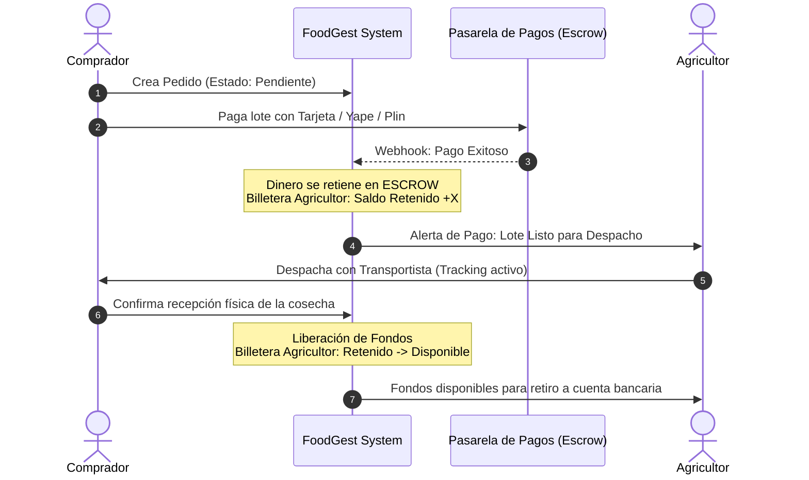

[Inicio](/) > [APIs](/apis/endpoints-implementados.md) > Integración de Pagos

# Integración con Pasarela de Pagos (Flujo de Escrow)

Para garantizar la seguridad en las transacciones comerciales B2B/B2C y evitar fraudes comunes en el sector agrícola (como la entrega de cosechas sin recibir el pago o el envío de dinero sin recibir el lote), FoodGest implementa un **Mecanismo de Escrow (Fondo en Garantía)**.

---

## 1. El Flujo de Escrow de FoodGest

El dinero de una compra nunca va directamente del comprador al agricultor al inicio. Se mantiene retenido de forma segura en una cuenta puente gestionada por el sistema hasta la confirmación de la entrega:

---

## 2. Métodos de Pago Soportados

Para adaptarse a la realidad financiera digital del Perú, se integran tres canales principales:
*   **Billeteras Digitales Rápidas:** **Yape** y **Plin**, ideales para transacciones rápidas de volumen medio.
*   **Tarjetas de Débito y Crédito:** Visa, Mastercard y Amex para compras mayoristas de toneladas de cosechas.
*   **Transferencia Bancaria Directa (PagoEfectivo / CIP):** Para grandes empresas que requieren pagos corporativos a través de sus bancas por internet.

---

## 3. Pasarelas de Pago Evaluadas

Durante el proceso de diseño se evaluaron tres pasarelas líderes en el mercado peruano:

1.  **Culqi (Seleccionada):**
    *   *Ventajas:* Excelente documentación API, SDK nativo para Spring Boot, y soporte nativo simplificado para pagos con Yape (mediante código de aprobación de 6 dígitos) y tarjetas bancarias. Su estructura de comisiones es transparente para emprendimientos tecnológicos.
2.  **Izipay:**
    *   *Ventajas:* Fuerte presencia física en Perú, pero descartada debido a que su documentación para integración en backend Java es fragmentada en comparación con competidores.
3.  **Niubiz (VisaNet):**
    *   *Ventajas:* La red transaccional más grande del país, ideal para montos masivos corporativos. Sin embargo, su proceso de afiliación comercial y comisiones mínimas mensuales fijas representan una barrera de entrada alta para la fase inicial de FoodGest.

---

## 4. Flujo Técnico del Webhook de Confirmación

Cuando el comprador realiza el pago en la app, la pasarela procesa la transacción de forma asíncrona. Una vez aprobada, Culqi emite una petición HTTP `POST` (**Webhook**) dirigida a nuestra API en `/api/pedidos/transacciones/webhook-pagos`.

### Proceso en el Backend:
1.  **Validación de Firma:** El backend intercepta el request y valida la firma digital provista en la cabecera `x-culqi-signature` usando la clave secreta compartida, previniendo suplantaciones.
2.  **Transaccionalidad:** Se verifica que la transacción no haya sido procesada previamente (evitando doble cobro).
3.  **Actualización de Estados:**
    *   El estado del `Pedido` pasa de `PENDIENTE` a `PAGADO`.
    *   Se crea un registro en `transacciones` con estado `APROBADO`.
    *   Se actualiza la `Wallet` del agricultor receptor sumando el monto neto de la venta a la columna `saldo_retenido`.

---

## 5. Tabla de Estados de Transacción y Transiciones

| Estado Inicial | Evento Desencadenante | Estado Destino | Acción Realizada por el Sistema |
| :--- | :--- | :--- | :--- |
| **`CREADA`** | Comprador inicia el checkout en la aplicación. | `PENDIENTE` | Se reserva temporalmente el stock de la oferta. |
| **`PENDIENTE`** | Webhook de pasarela confirma cobro exitoso. | `APROBADA` | El dinero entra en escrow. Saldo retenido del agricultor aumenta. |
| **`PENDIENTE`** | Pasarela rechaza la tarjeta por fondos insuficientes o fraude. | `RECHAZADA` | Se cancela la transacción y se libera el stock de la oferta. |
| **`APROBADA`** | Comprador confirma recepción conforme de la mercancía. | `LIBERADA` | Los fondos pasan de saldo retenido a disponible en la billetera. |
| **`APROBADA`** | Arbitraje administrativo da la razón al comprador por lote dañado. | `REEMBOLSADA`| Se devuelve el capital íntegro al comprador. |

---

## Ver también

- [Catálogo de Endpoints Implementados](/apis/endpoints-implementados.md)
- [Esquema del Dominio Pedidos](/arquitectura/dominios.md#6-pedidos)
- [Glosario: Concepto de Escrow](/glosario.md#e)
