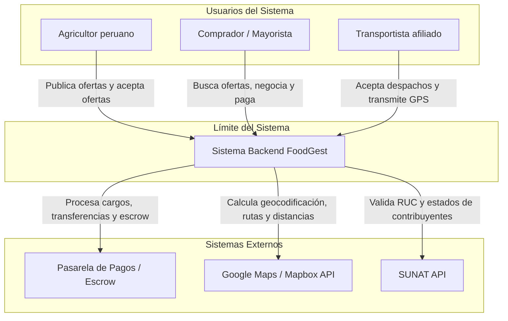
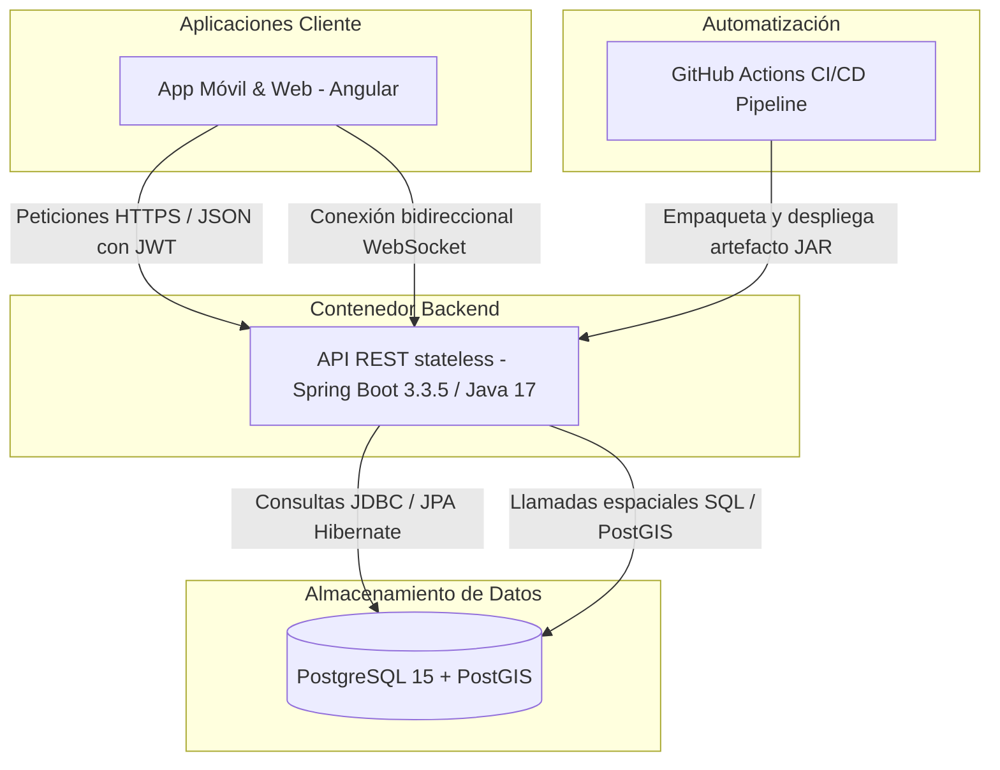

[Inicio](/) > [Arquitectura](/arquitectura/README.md) > Introducción

# Arquitectura de FoodGest

La plataforma **FoodGest** está diseñada bajo un enfoque arquitectónico escalable, desacoplado y orientado al dominio, estructurado específicamente para atender las necesidades del sector agrícola B2B/B2C en el Perú. 

Este documento detalla los principios de diseño fundamentales y los diagramas en modelo C4 (Nivel 1 y Nivel 2) que gobiernan el sistema.

---

## 1. Visión General del Sistema

FoodGest opera como un intermediario digital directo (*similar a InDrive*) adaptado a la comercialización agraria. Permite a los agricultores de diversas regiones del Perú publicar ofertas de sus cosechas en tiempo real, mientras que los compradores (mayoristas, restaurantes, cadenas de suministro o consumidores finales) pueden localizarlas mediante búsquedas geoespaciales, negociar precios por volumen y coordinar transportistas verídicos para el traslado seguro de la mercancía.

---

## 2. Diagrama C4 - Nivel 1: Contexto del Sistema

Este diagrama ilustra a los actores que interactúan con FoodGest y los sistemas externos con los que se integra la plataforma para ofrecer un servicio transaccional íntegro.

---

## 3. Diagrama C4 - Nivel 2: Contenedores del Sistema

El siguiente diagrama detalla los contenedores de software que componen la solución tecnológica y cómo fluyen los datos entre el cliente móvil, la API REST en Spring Boot, la base de datos PostgreSQL con soporte PostGIS y la infraestructura de despliegue continuo.

---

## 4. Principios de Diseño Adoptados

Para garantizar que el código se mantenga mantenible y ampliable por los múltiples miembros del equipo de ingeniería de software, se han establecido cinco principios clave:

1. **Modularidad por Dominio (DDD Lite):** Separación del código en paquetes verticales que encapsulan toda la lógica de un dominio de negocio, evitando el acoplamiento cruzado y la dispersión de la lógica transaccional.
2. **Estrategia Stateless Estricta:** La autenticación se valida en cada request a través de tokens JWT firmados criptográficamente. El backend no mantiene sesiones activas (`HttpSession`), facilitando el escalado horizontal y la compatibilidad con clientes móviles.
3. **Consistencia Transaccional Asegurada (`@Transactional`):** Procesos críticos como el registro de usuarios con perfiles específicos y la creación de billeteras se ejecutan en transacciones atómicas bajo el principio ACID.
4. **Validación Estandarizada:** Cada DTO expuesto está rigurosamente anotado mediante `jakarta.validation.constraints` para impedir que datos corruptos lleguen a la capa de persistencia.
5. **Abstracción de Datos Espaciales:** Toda consulta de geocercas, radios de entrega y mapas se delega a nivel de base de datos con PostGIS, garantizando respuestas rápidas y de bajo consumo de CPU.

---

## Ver también

- [Stack Tecnológico](/arquitectura/stack-tecnologico.md)
- [ADR-02: Arquitectura Modular por Dominio](/arquitectura/adr-02-ddd-lite.md)
- [Estructura de Dominios y Reglas de Comunicación](/arquitectura/dominios.md)
