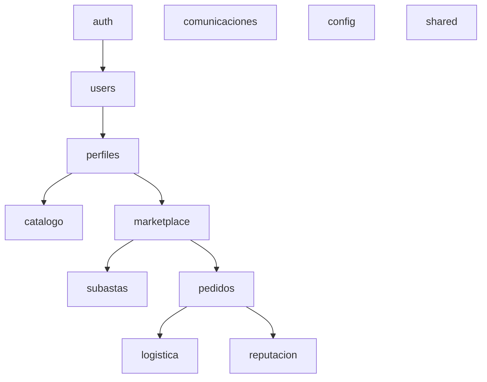

[Inicio](/) > [Arquitectura](/arquitectura/README.md) > Dominios de Negocio

# Catálogo de Dominios y Reglas de Comunicación

La arquitectura de **FoodGest** organiza sus funcionalidades en **12 dominios verticales autocontenidos** (DDD Lite). Esto evita dependencias circulares y mantiene un diseño modular fácil de mantener.

---

## 1. Mapa de Dominios de FoodGest

---

## 2. Descripción Detallada de los 12 Dominios

### 1. auth
*   **Propósito:** Encapsula la seguridad del sistema, emisión, firmado y validación de JSON Web Tokens (JWT).
*   **Tablas que contiene:** Ninguna directamente (opera sobre la tabla `users` mediante consultas seguras).
*   **Endpoints Clave:**
    *   `POST /api/auth/register` (Público - Registro unificado de usuarios con perfiles y wallets).
    *   `POST /api/auth/login` (Público - Autenticación que genera Access y Refresh Token).
    *   `POST /api/auth/refresh` (Público - Renovación segura de tokens expirados).

### 2. users
*   **Propósito:** Gestiona las cuentas de usuario a nivel de infraestructura general y sus saldos financieros.
*   **Tablas que contiene:** `users`, `wallets`, `movimientos_wallet`.
*   **Endpoints Clave:**
    *   `GET /api/users` (Admin - Listar cuentas).
    *   `GET /api/users/{id}` (Autenticado - Ver cuenta propia).
    *   `PUT /api/users/{id}` (Autenticado - Editar datos generales).
    *   `GET /api/users/{id}/wallet` (Autenticado - Consultar saldo disponible e historial de movimientos).

### 3. perfiles
*   **Propósito:** Administra los datos detallados específicos según el rol asumido en el negocio.
*   **Tablas que contiene:** `agricultores`, `compradores`, `transportistas`.
*   **Endpoints Clave:**
    *   `GET /api/perfiles/agricultores/{id}` (Obtener perfil detallado de productor).
    *   `PUT /api/perfiles/agricultores/{id}` (Editar información de finca y parcela).
    *   `GET /api/perfiles/transportistas` (Buscar transportistas con vehículos aptos).

### 4. catalogo
*   **Propósito:** Catálogo estático de productos agrícolas homologados por la plataforma.
*   **Tablas que contiene:** `categorias`, `productos`, `fotos_producto`.
*   **Endpoints Clave:**
    *   `GET /api/catalogo/categorias` (Listar categorías como Hortalizas, Tubérculos, Frutas).
    *   `GET /api/catalogo/productos` (Listar productos con fotos de referencia).
    *   `POST /api/catalogo/productos` (Solo Admin - Agregar nuevo producto al maestro).

### 5. marketplace
*   **Propósito:** El motor principal de transacciones de ofertas directas y negociaciones multilaterales.
*   **Tablas que contiene:** `ofertas`, `precios_escalonados`, `precios_mercado`, `negociaciones`.
*   **Endpoints Clave:**
    *   `GET /api/marketplace/ofertas` (Búsqueda geoespacial por mapa, radio y filtros).
    *   `POST /api/marketplace/ofertas` (Agricultor - Publicar nuevo lote de cosecha).
    *   `POST /api/marketplace/negociaciones` (Comprador - Iniciar oferta de contrapropuesta).
    *   `PUT /api/marketplace/negociaciones/{id}/responder` (Agricultor - Aceptar o rechazar precio negociado).

### 6. pedidos
*   **Propósito:** Procesa las compras cerradas de ofertas o subastas ganadas, manejando las transacciones de escrow.
*   **Tablas que contiene:** `pedidos`, `detalle_pedidos`, `transacciones`.
*   **Endpoints Clave:**
    *   `POST /api/pedidos` (Comprador - Crear orden formal de compra).
    *   `POST /api/pedidos/{id}/pagar` (Comprador - Registrar pago a cuenta escrow).
    *   `GET /api/pedidos/{id}` (Ver estados: `pendiente`, `pagado`, `en_camino`, `completado`).

### 7. logistica
*   **Propósito:** Monitorea el transporte físico y despacho terrestre de las cosechas vendidas.
*   **Tablas que contiene:** `tracking_pedido`.
*   **Endpoints Clave:**
    *   `POST /api/logistica/tracking` (Crear tracking para un pedido pagado).
    *   `PUT /api/logistica/tracking/{id}/ubicacion` (Transportista - Emitir coordenadas GPS actuales).
    *   `GET /api/logistica/tracking/{pedidoId}` (Comprador/Vendedor - Monitoreo en mapa en tiempo real).

### 8. comunicaciones
*   **Propósito:** Chats entre participantes del marketplace para coordinar despachos y alertas del sistema.
*   **Tablas que contiene:** `mensajes`, `notificaciones`.
*   **Endpoints Clave:**
    *   `GET /api/comunicaciones/chats/{pedidoId}` (Obtener conversación de coordinación).
    *   `GET /api/comunicaciones/notificaciones` (Listar alertas de subastas, negociaciones o pagos).

### 9. reputacion
*   **Propósito:** Garantiza confianza en las transacciones mediante calificaciones bilaterales.
*   **Tablas que contiene:** `calificaciones`.
*   **Endpoints Clave:**
    *   `POST /api/reputacion/calificar` (Evaluar contraparte después de un pedido entregado).
    *   `GET /api/reputacion/usuarios/{usuarioId}` (Ver promedio de estrellas y reseñas de un usuario).

### 10. subastas
*   **Propósito:** Permite subastar lotes grandes de producción agraria al mejor postor.
*   **Tablas que contiene:** `subastas`, `pujas_subasta`, `suscripciones`.
*   **Endpoints Clave:**
    *   `POST /api/subastas` (Agricultor - Crear subasta con precio base e incremento mínimo).
    *   `POST /api/subastas/{id}/pujar` (Comprador - Registrar nueva puja económica).
    *   `POST /api/subastas/suscripciones` (Suscribirse a alertas de nuevos lotes de productos específicos).

### 11. config
*   **Propósito:** Contiene las clases de configuración técnica del ecosistema Spring (CORS, Jackson, Swagger, seguridad básica).
*   **Tablas que contiene:** Ninguna.

### 12. shared
*   **Propósito:** Clases utilitarias transversales y manejador de excepciones globales compartidas por todos los dominios.
*   **Tablas que contiene:** Ninguna.

---

## 3. Reglas de Comunicación entre Dominios

Para evitar el acoplamiento y asegurar que los dominios permanezcan limpios y aislados, se establecen las siguientes reglas de obligatorio cumplimiento:

1.  **Aislamiento de Controladores:** Un `Controller` de un dominio (ej. `SubastaController`) **NUNCA** debe inyectar o llamar a un servicio de otro dominio (ej. `UserService`). Cada controlador interactúa exclusivamente con los servicios de su propio dominio.
2.  **Inyección por Interfaz:** Si el dominio `A` necesita datos del dominio `B` (ej. `PedidoServiceImpl` requiere descontar saldo de `Wallet`), el servicio de `A` debe inyectar la **Interfaz de Servicio** de `B` (`IWalletService`), jamás inyectar directamente la clase de implementación (`WalletServiceImpl`) ni acceder directamente al repositorio de base de datos ajeno (`WalletRepository`).
3.  **Prohibición de Joins Inter-Dominios en JPA:** Las entidades de un dominio no deben realizar mapeos directos `@ManyToOne` o `@OneToMany` hacia entidades de otros dominios de alta volatilidad (ej. `Pedido` no debe tener una relación directa `@ManyToOne` hacia `Oferta` mapeada por JPA si pertenecen a dominios distintos, en su lugar se guarda únicamente el campo `UUID ofertaId` para desacoplar las bases de datos).
4.  **Uso de Shared:** Las únicas clases que pueden ser importadas de forma global por todos los dominios son aquellas ubicadas dentro de `com.foodgest.shared` (DTOs de respuesta estándar, excepciones globales y utilidades puras de cálculo de distancia).

---

## Ver también

- [ADR-02: Organización por Dominios (DDD Lite)](/arquitectura/adr-02-ddd-lite.md)
- [Convenciones de Nomenclatura de Código](/guias-desarrollo/convenciones-codigo.md)
- [Endpoints del Sistema](/apis/endpoints-implementados.md)
