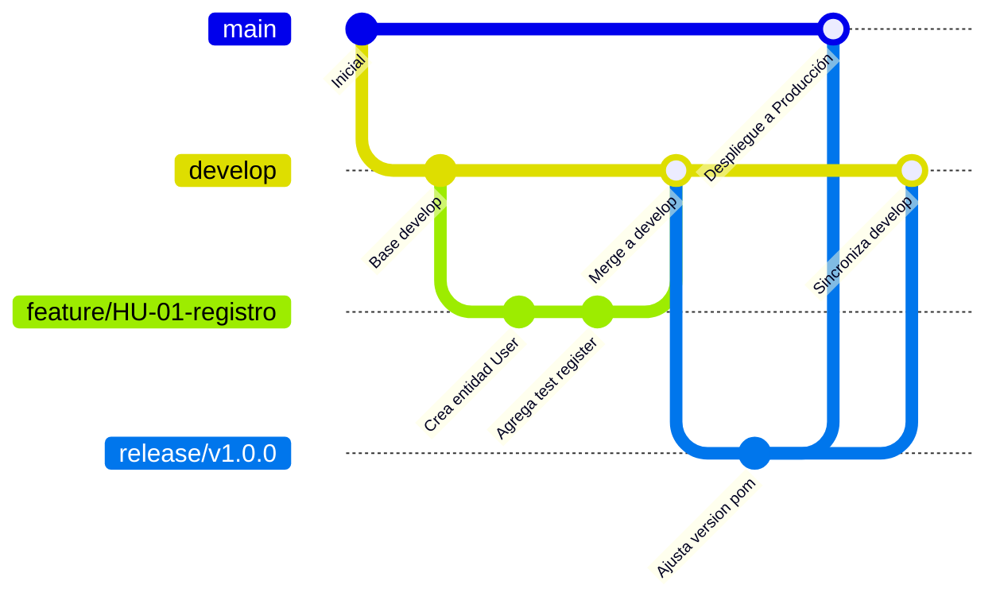

[Inicio](/) > [Guías de Desarrollo](/guias-desarrollo/convenciones-codigo.md) > Git Flow

# Estrategia de Ramas Git Flow

Para coordinar de manera ordenada el desarrollo simultáneo de funcionalidades y correcciones de bugs por parte de todos los miembros del equipo, FoodGest utiliza una versión adaptada y simplificada del flujo de trabajo **Git Flow**.

---

## 1. Diagrama del Flujo de Ramas

El siguiente diagrama ilustra el ciclo de vida de las ramas en el repositorio y la dirección de los merges:



---

## 2. Definición y Propósito de las Ramas

### Ramas Principales (Infinitas)

*   **`main` (Producción):**
    *   **Propósito:** Contiene el código fuente estable de producción. Cada commit en esta rama representa un despliegue exitoso al entorno de producción.
    *   **Protección:** Está estrictamente protegida. Ningún desarrollador puede hacer `push` directo. Solo se modifica mediante Pull Requests validados desde ramas `release/*` o `hotfix/*`.
*   **`develop` (Integración):**
    *   **Propósito:** Concentra todas las funcionalidades terminadas que serán parte de la próxima versión. Es la rama base de trabajo diario del equipo.
    *   **Protección:** Requiere compilación limpia en CI/CD antes de permitir merges automáticos.

### Ramas Temporales (De Apoyo)

*   **`feature/HU-XX-descripcion` (Funcionalidades):**
    *   **Rama de Origen:** `develop`
    *   **Rama de Destino:** `develop`
    *   **Propósito:** Desarrollo de nuevas funcionalidades vinculadas a una Historia de Usuario (HU) específica de Trello.
*   **`fix/FG-XXX-descripcion` (Corrección de Bugs):**
    *   **Rama de Origen:** `develop`
    *   **Rama de Destino:** `develop`
    *   **Propósito:** Resolución de errores detectados en entornos de prueba o durante la integración diaria.
*   **`release/vX.X.X` (Preparación de Versiones):**
    *   **Rama de Origen:** `develop`
    *   **Rama de Destino:** `main` y `develop`
    *   **Propósito:** Fase de estabilización y pruebas de regresión antes de congelar y desplegar la versión. Solo se permiten correcciones menores a esta rama.
*   **`hotfix/HU-XX-descripcion` (Parche Crítico):**
    *   **Rama de Origen:** `main`
    *   **Rama de Destino:** `main` y `develop`
    *   **Propósito:** Resolución de fallos críticos e inmediatos detectados en producción que no pueden esperar al ciclo regular de sprint.

---

## 3. Ejemplos Reales de Nombres de Ramas en FoodGest

*   **Para una nueva característica:** `feature/HU-12-registro-agricultor`
*   **Para una corrección en desarrollo:** `fix/FG-205-error-coordenadas-postgis`
*   **Para parchear un error crítico en producción:** `hotfix/FG-911-caida-pasarela-escrow`
*   **Para la entrega del Sprint 1:** `release/v1.0.0`

---

## 4. Proceso Paso a Paso para Integrar Cambios

### Paso 1: Crear la rama local
Actualizar `develop` y desprender la rama de trabajo:
```bash
git checkout develop
git pull origin develop
git checkout -b feature/HU-12-registro-agricultor
```

### Paso 2: Desarrollar y realizar commits locales
Trabajar aplicando la convención de [Conventional Commits](/guias-desarrollo/conventional-commits.md):
```bash
git add .
git commit -m "feat(auth): implementar persistencia del perfil agricultor con MapsId"
```

### Paso 3: Sincronizar cambios de develop (Rebase diario)
Para mitigar conflictos masivos de merge al final, sincroniza los avances del equipo diariamente utilizando `rebase`:
```bash
git checkout develop
git pull origin develop
git checkout feature/HU-12-registro-agricultor
git rebase develop
```

### Paso 4: Subir la rama y abrir Pull Request
Subir la rama local al repositorio remoto en GitHub:
```bash
git push origin feature/HU-12-registro-agricultor
```
*   Ingresar a GitHub y abrir un **Pull Request (PR)** hacia la rama **`develop`**.
*   Completar el checklist mandatorio del proyecto.
*   Asignar al menos a un revisor técnico.

---

## Ver también

- [Checklist de Pull Requests](/guias-desarrollo/checklist-pull-requests.md)
- [Convenciones de Conventional Commits](/guias-desarrollo/conventional-commits.md)
- [Definición de Ready (DoR) para Tareas](/procesos/definition-of-ready.md)
