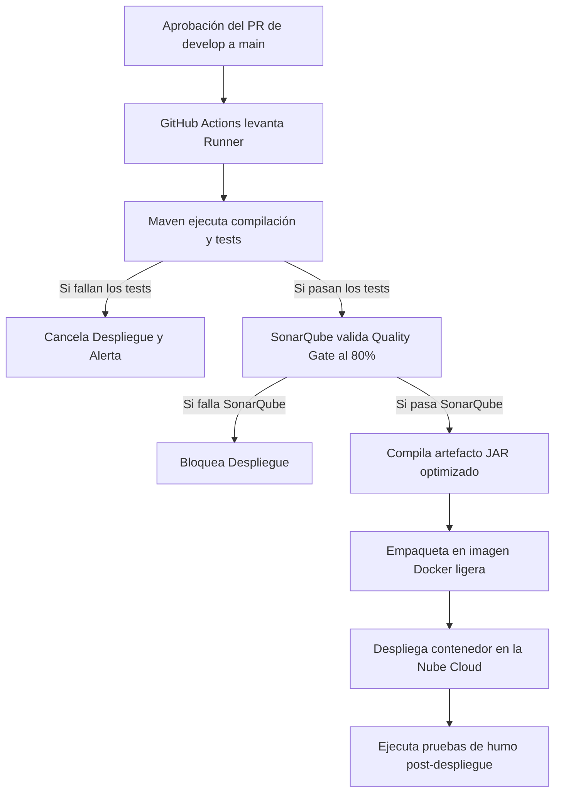

[Inicio](/) > [Procesos](/procesos/definition-of-done.md) > Despliegue y Rollback

# Proceso de Despliegue y Plan de Rollback

Para mitigar riesgos operativos y asegurar que la plataforma **FoodGest** mantenga su alta disponibilidad transaccional, los despliegues de software se realizan bajo directrices estrictas y flujos automatizados de CI/CD.

---

## 1. Proceso de Despliegue Paso a Paso

El despliegue en entornos de producción se realiza a través de **GitHub Actions** al finalizar de forma exitosa cada Sprint:



---

## 2. Checklist Pre-Despliegue

Antes de dar la orden de mezclar a `main`, el líder técnico debe validar los siguientes puntos críticos:

*   [ ] **Migraciones de BD Listas:** ¿Los scripts de actualización física de base de datos están coordinados y probados en Staging?
*   [ ] **Variables de Entorno Configuradas:** Si la nueva versión requiere claves o variables adicionales (ej. una nueva versión de API externa), ¿están cargadas en las configuraciones del servidor Cloud de producción?
*   [ ] **Ventana de Mantenimiento:** ¿Se programó el despliegue en horas de menor tráfico transaccional agrícola (usualmente altas horas de la noche)?
*   [ ] **Copia de Seguridad:** Se ha ejecutado un respaldo instantáneo (*snapshot*) del volumen de base de datos PostgreSQL de producción antes de iniciar.

---

## 3. Plan de Rollback (Retorno a versión segura)

Si durante el despliegue o inmediatamente después de este se detecta una degradación severa del servicio (errores `500` masivos, caída de la pasarela de pagos, bloqueos en base de datos o fallos del rastreo de logística):

> [!WARNING]
> **NUNCA** intentes solucionar un bug complejo aplicando parches rápidos directos sobre la marcha en producción (*hot-fixes improvisados*). La regla de oro en FoodGest es: **Ante fallas graves no resueltas en 10 minutos, se ejecuta Rollback inmediato.**

### Pasos para Ejecutar el Rollback:

#### Paso 1: Revertir versión de contenedor Docker
Conéctate a la consola de administración de tu servidor Cloud o ejecuta el despliegue manual apuntando a la etiqueta (*tag*) de la imagen Docker de la versión anterior que estaba estable (ej. `v1.2.4` en lugar de `v1.3.0` fallida):
```bash
# Comando de ejemplo para redespliegue de versión estable previa en terminal de orquestación
docker service update --image registry.foodgest.com/backend:v1.2.4 foodgest_backend_service
```

#### Paso 2: Revertir base de datos (Si aplica)
Si el despliegue incluyó cambios de esquema físicos destructivos incompatibles con la versión estable anterior:
1.  Pausa temporalmente las conexiones HTTP entrantes pintando una pantalla estática de mantenimiento.
2.  Restaura la base de datos PostgreSQL al *snapshot* de seguridad tomado en el Checklist Pre-Despliegue utilizando la consola RDS/PostgreSQL:
```sql
-- Detener conexiones activas para restaurar sin bloqueos
SELECT pg_terminate_backend(pg_stat_activity.pid)
FROM pg_stat_activity
WHERE pg_stat_activity.datname = 'foodgest'
  AND pid <> pg_backend_pid();
```
3.  Levanta el servicio y verifica que los logs de la versión recuperada corran sin emitir excepciones de conexión.

---

## 4. Checklist Post-Despliegue

Una vez completado el despliegue (o el rollback), ejecuta estas validaciones rápidas (*Pruebas de Humo*):

*   [ ] **Verificar endpoint de salud:** Llamada a `GET /api/users` responde con `200 OK` y JSON válido de usuarios.
*   [ ] **Log de arranque libre de excepciones:** Revisar que el log del servidor no presente trazas de error de conexión a PostGIS ni fallos de carga de beans de seguridad.
*   [ ] **Prueba de Pago Escrow en Sandbox:** Realizar una transacción de prueba con datos simulados en producción para validar conectividad con Culqi.

---

## Ver también

- [Runbooks de Diagnóstico Rápido](/procesos/runbooks.md)
- [Gestión de Variables de Entorno](/configuracion/variables-entorno.md)
- [Definition of Done (DoD)](/procesos/definition-of-done.md)
